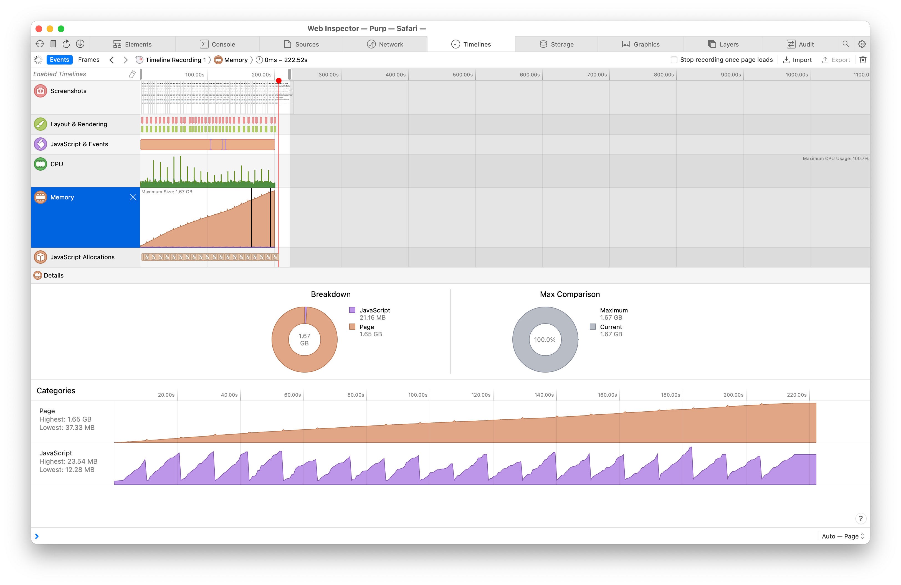
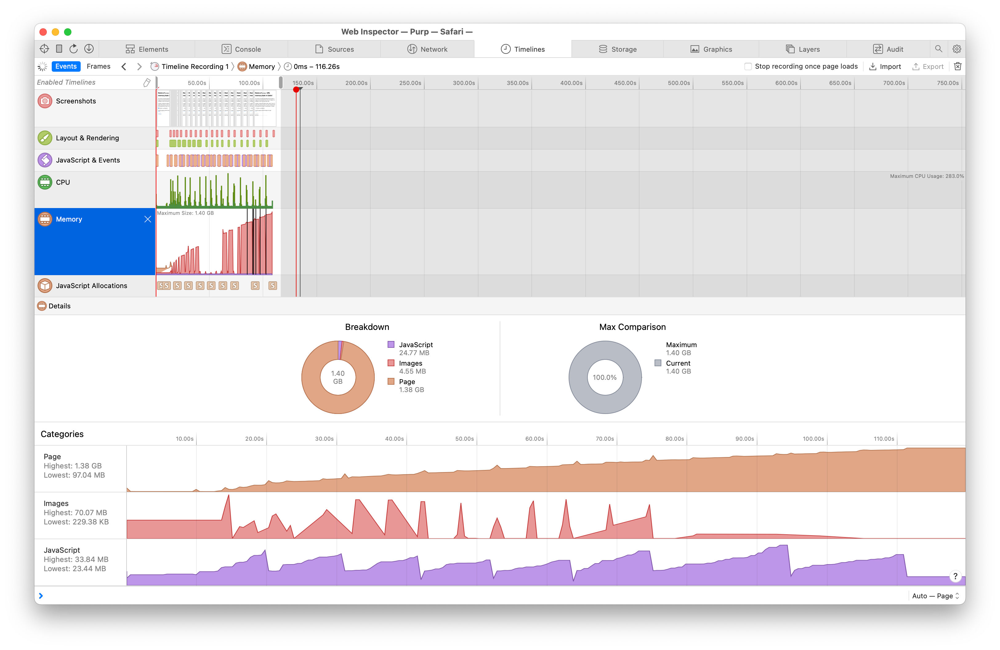

# Demonstration of `object URLs` leaking memory in WebKit

## Revoking with `URL.revokeObjectURL()` does not adequately free memory

**Meaning a window/tab will eventually crash from memory exhaustion after normal navigation of an SPA that correctly creates and revokes `object URLs`.**

## Setup

To run a small web server for this project, use any simple server you like for
example:

```sh
npx serve
```

which listens on port `:3000` on `localhost` by default.

### The test

👉 Navigate to the test app, ex: `http://localhost:3000/` or if you are browsing from your phone, ex: `http://10.1.1.10:3000/`

The code in this repo will create and revoke `object URLs` for Unsplash thumbnails in batches of 100. One can choose how many batches (pages), and if you want to see the images visually or not.

The default settings are enough to crash a tab in mobile Safari on an iPhone 14 Pro running 16.4.1 – it consistently crashes after 52–54 batches.

Using an iPhone SE running 15.7.6, it consistently crashes after 30–32 batches.

Choosing to render the images causes mobile Safari to crash in around half the time. The iPhone SE consistently crashes after 15–18 batches when choosing to render the `img`s visually as part of the test. **However, rendering the `object URLs` is not required** to crash mobile Safari, it just speeds up the process.

### How do I know the tab crashed in mobile Safari?

The tab will reload itself. When the test is running, the “Run tests” button is disabled. If the button is suddenly enabled and the in-page logs are gone, then the tab has reloaded. _If the test run completes without crashing, “Done. Succeeded.” will be logged to the page so it should be clear._

I recommend connecting to the phone’s Safari devtools from macOS Safari to see what the last logs were before it crashed. You can also profile the memory on your device and see how high it goes before it crashes. _The iPhone 14 Pro device I used has reached 1.65GB of “page” memory, for example._

### Expected outcome

It is expected that revoked `object URLs` go away, and do not continue to contribute to the total memory size of the page.

## Why does this matter?

For an SPA designed to display images using `object URLs`, the app is a ticking time bomb 💣.

It will crash after the user has navigated enough pages of images to leak enough memory. An SPA designed to be left open all day could reach the memory exhaustion point long after it’s initially opened, which makes debugging and reproducing this bug difficult.

One can imagine an E2EE photo sharing app, similar to Flickr or Glass, built as an SPA, which needs to use `object URLs` to display images after they are downloaded and decrypted, and which would have consistent crashes for mobile Safari users as they navigate between profiles and pages of images.

This basically means: **one cannot safely use `object URLs` in an SPA.**

## Screenshots

### Memory growth when creating then revoking `object URLs` (not displayed on screen, just created and then revoked):



The tab crashed at this point and the devtools connection was lost.

### Memory growth when creating, providing as the `src` of an `img`, then revoking `object URLs`:



The tab crashed at this point and the devtools connection was lost.
